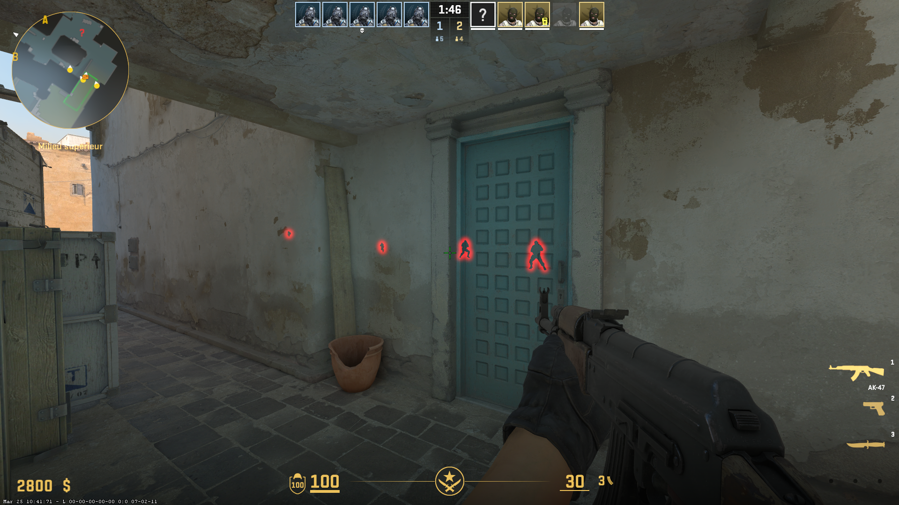

# cs2-external-glow

External glow for CS2 written in Python. No injection, no driver. Uses ReadProcessMemory / WriteProcessMemory only.
---



## Requirements

- Windows
- Python
- Cs2 running 

No third-party dependencies. Only standard library.

---

## Usage

```
python cs2glow.py
```

---

## Configuration

Edit the top of `cs2glow.py`:

```python
GLOW_COLOR  = (0.0, 1.0, 0.5)   # RGB float, values from 0.0 to 1.0
TEAM_CHECK  = True               # True = skip teammates
GLOW_RANGE  = 10000              # glow visibility range
```

Color examples:

```
Red     (1.0, 0.0, 0.0)
Green   (0.0, 1.0, 0.0)
Blue    (0.0, 0.0, 1.0)
White   (1.0, 1.0, 1.0)
```

---

## Offsets

Offsets are hardcoded and may break after a game update. Update them from:
https://github.com/a2x/cs2-dumper

```python
dwEntityList      = 0x24B0258
dwLocalPlayerPawn = 0x206A9E0
m_Glow            = 0xCC0
```

---

## Disclaimer

For educational purposes only.

